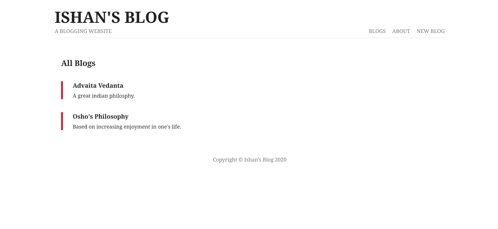
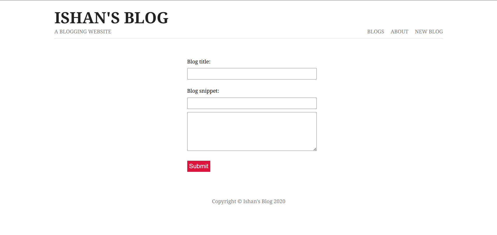
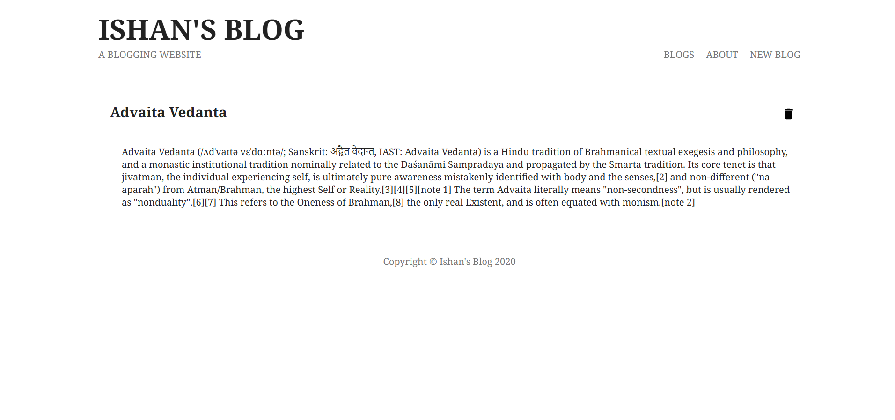

# Basic-Blogging-WebApp
A simple blog web application built using **Node.js**, **Express**, **MongoDB**, and **EJS** templating.

---

## 🚀 Features

- Create, view, and delete blog posts
- Server-side rendering with EJS
- RESTful routing using Express
- MongoDB database integration using Mongoose
- Custom 404 page
- Middleware (Morgan for logging, static files, etc.)

---

## 🛠️ Technologies Used

- **Node.js**
- **Express.js**
- **MongoDB** & **Mongoose**
- **EJS (Embedded JavaScript templates)**
- **Nodemon** for auto-reloading
- **Morgan** for logging HTTP requests

---

## 📸 Project Screenshots

### 🔹 Homepage

### 🔹 Create New Blog

### 🔹 Blog Details

### 🔹 About Page

